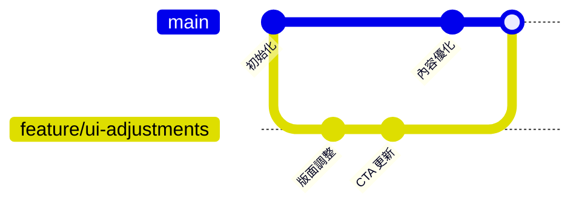

# 李慕約顧問課程 Landing Page

這個專案是一個為「李慕約」生成式 AI 策略顧問課程打造的單頁式網站原型，內容包含：
- Hero 區塊與多重 CTA
- 顧問背景與核心數據亮點
- 課程／顧問服務介紹與學習成果
- 六週課程大綱與方案定價
- 社群資源、顧問預約與聯絡資訊

直接開啟 `index.html` 即可預覽設計稿。

## 專案目錄結構

## 使用者瀏覽流程

## Git 分支示意

